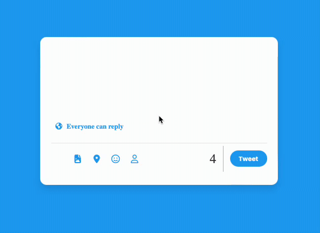

<h1> Twitter Card </h1>

1-Twitter Tweet ekleme alanı tasarımı yapıldı
2-Input focus olduğunda (yani üstüne tıklandığında) rengi değişti
3-Inputta klavye girişi olduğunda placeholder kayboldu
4-Alt kısımda bir sayaç açıldı
5-Kalan karakter limitini tutması sağlandı
6-Eğer inputta giriş yoksa tweet butonunun pasif olması sağlandı
7-Karakter limiti aşımı geçtiğinde her fazla harfin kırmızı background olması sağlandı
8-Sayaçta da geçilen karakter kırmızı ve eksi ile gösterildi

<h2> Kullanılan Teknolojiler <h2>

HTML5 CSS JS

<h2> Sitenin çalışır gif hali </h2>

